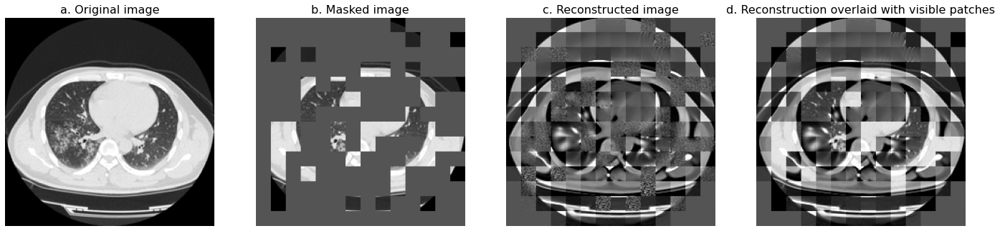
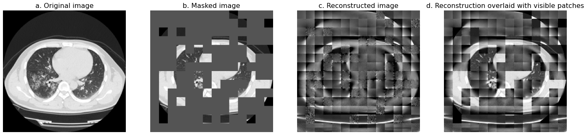

# Pre-trained Natural Image Models are Few-shot Learners for Medical Image Classification: COVID-19 Diagnosis as an Example

This repository contains the code and datasets for the paper "Pre-trained Natural Image Models are Few-shot Learners for Medical Image Classification: COVID-19 Diagnosis as an Example". It hleps to direct users to reproduce our reported results.

## Contents

- [x] Demo of Visual Reconsruction by MAE in Medical Images
- [x] Pre-training Datasets
- [x] Fine-tuning Datasets
- [x] Transitional training scheme
- [x] Pre-trained models for fine-tuning
- [x] Intermediate models for fine-tuning
- [x] Pre-training recipes
- [x] Fine-tuning recipes

## Demo of Visual Reconsruction by MAE in Medical Images
<figure style="text-align: center; margin: 0 auto;">
  
  <figcaption style="text-align: center; font-size: 14px; margin-top: 6px;">Visual Reconsruction of MAE-B/16_DATA14</figcaption>
</figure>

<figure style="text-align: center; margin: 0 auto;">
  
  <figcaption style="text-align: center; font-size: 14px; margin-top: 6px;">Visual Reconsruction of MAE-B/16_C1000</figcaption>
</figure>

## Transitional training scheme

  <figcaption style="text-align: center; font-size: 14px; margin-top: 6px;">As shown in the figure, Transitional Training Scheme comprises two phases. In phase-1 (depicted within
  fine-tune a pre-trained natural image model and produce an intermediate model. In phase- 2 (depicted within the yellow frame), this intermediate model is further fine-tuned on the target few-shot dataset U orig and yield the final few-shot COVID-19 diagnosis model.</figcaption>

## Pre-training Datasets

<table>
<caption>Specifications of the 14 self-collected public COVID-19 CT image datasets making up of the pre-training composite dataset</caption>
<tbody>
<!-- START TABLE -->
<!-- TABLE HEADER -->
<th valign="bottom">Name</th>
<th valign="bottom">Abbreviation</th>
<th valign="bottom">COVID</th>
<th valign="bottom">Normal</th>
<th valign="bottom">Bacteria</th>
<th valign="bottom">Dataset size</th>

<tr><td align="left"><a href="https://www.kaggle.com/soham1024/chest-ct-scans-with-covid19">chest-ct-scans-with-COVID-19</a></td> <td align="left"> CHE </td><td align="left"> 27,781 </td><td align="left">  0 </td><td align="left">  0 </td><td align="left">  27,781 </td></tr>
<tr><td align="left"><a href="https://github.com/GeneralBlockchain/covid-19-chest-xray-segmentations-dataset">COVID-19_ct_scans1</a></td> <td align="left"> CCT </td><td align="left">  1,762 </td><td align="left">  0 </td><td align="left">  0 </td><td align="left">  1,762 </td></tr>
<tr><td align="left"><a href="https://covid-segmentation.grand-challenge.org/">COVID-19-20_v2</a></td> <td align="left"> C1920 </td><td align="left">  6,723 </td><td align="left">  0 </td><td align="left">  0 </td><td align="left">  6,723 </td></tr>
<tr><td align="left"><a href="https://wiki.cancerimagingarchive.net/pages/viewpage.action?pageId=70226443">COVID-19-AR</a></td> <td align="left"> CAR </td><td align="left">  18,592 </td><td align="left">  0 </td><td align="left">  0 </td><td align="left">  18,592 </td></tr>
<tr><td align="left"><a href="https://figshare.com/authors/MedSeg/9940190">COVID-19-CT-segmentation-dataset</a></td> <td align="left"> CCS </td><td align="left">  110 </td><td align="left"> 	0 </td><td align="left"> 	0 </td><td align="left"> 	110 </td></tr>
<tr><td align="left"><a href="https://pubmed.ncbi.nlm.nih.gov/33980279/">COVID19-CT-Dataset1000+</a></td> <td align="left"> C1000 </td><td align="left">  307,765 </td><td align="left"> 	0 </td><td align="left"> 	0 </td><td align="left"> 	307,765 </td></tr>
<tr><td align="left"><a href="https://www.cancerimagingarchive.net/collection/ct-images-in-covid-19">CT_Images_in_COVID-19</a></td> </td><td align="left"> 	CIC	</td><td align="left">  32,548 </td><td align="left">  0 </td><td align="left">  0 </td><td align="left">  32,548 </td></tr>
<tr><td align="left"><a href="https://www.cancerimagingarchive.net/collection/midrc-ricord-1a/">MIDRC-RICORD-1A</a></td> <td align="left"> MRA </td><td align="left">  9,833 </td><td align="left">  0 </td><td align="left">  0 </td><td align="left"> 	9,833 </td></tr>
<tr><td align="left"><a href="https://www.cancerimagingarchive.net/collection/midrc-ricord-1b/">MIDRC-RICORD-1B</a></td> <td align="left"> MRB </td><td align="left">  5,501 </td><td align="left"> 	0 </td><td align="left"> 	0 </td><td align="left"> 	5,501 </td></tr>
<tr><td align="left"><a href="https://www.kaggle.com/plameneduardo/sarscov2-ctscan-dataset">sarscov2-ctscan-dataset</a></td> </td><td align="left">  SC </td><td align="left">  1,252 </td><td align="left">  1,229 </td><td align="left">  0 </td><td align="left">  2,481 </td></tr>
<tr><td align="left"><a href="https://sirm.org/category/covid-19/">SIRM-COVID-19 (data removed by the host now)</a></td> <td align="left"> SIRM </td><td align="left"> 	599 </td><td align="left">  0	</td><td align="left">  0	</td><td align="left">  599 </td></tr>
<tr><td align="left"><a href="https://alexswong.github.io/COVID-Net/">COVIDX-CT-2A</a></td> <td align="left"> CXC </td><td align="left">  93,975	</td><td align="left">  59,510 </td><td align="left">  0 </td><td align="left">  153,485 </td></tr>
<tr><td align="left"><a href="https://www.kaggle.com/maedemaftouni/large-covid19-ct-slice-dataset">large-COVID-19-ct-slice-dataset</a></td> <td align="left"> LC </td><td align="left">  7,593 </td><td align="left">  6,893 </td><td align="left">  0 </td><td align="left">  14,486 </td></tr>
<tr><td align="left"><a href="https://data.mendeley.com/datasets/3y55vgckg6/2">COVID-19-and-common-pneumonia-chest-CT-dataset</a></td> <td align="left"> CC </td><td align="left">  41,813 </td><td align="left">  0 </td><td align="left">  55,219 </td><td align="left">  97,032 </td></tr>
<tr><td align="left"> Summation </td> <td align="left">  / </td> <td align="left">  555,847 </td> <td align="left">  67,632 </td> <td align="left">  55,219 </td> <td align="left">  678,698 </td></tr>
<tr><td></td><td></td><td></td><td></td><td></td><td></td></tr>
<!-- TABLE BODY -->
</tbody>
</table>

## Fine-tuning Datasets
The downstream fine-tuning dataset is sourced from the work of [COVID-CT-Dataset: A CT Scan Dataset about COVID-19](https://doi.org/10.48550/arXiv.2003.13865), which has established a real-world COVID-19 CT image dataset, UCSD-AI4H-COVID-CT (named **U_orig** for abbreviation in our work, and ‘orig’ means ‘original’).This is relatively popular in the deep learning-based medical image analysis community, especially the area related to COVID-19 diagnosis.

One thing noteworthy is that U_orig does not account for the patient level of CT scans, implying that each patient has multiple adjacent CT images (slices) in one CT scan. For a more stringent performance evaluation in our experiments, we select only one slice from each patient, creating a smaller dataset named U_sani (‘sani’ means ‘sanitized’). U_sani consists of 131 positive samples and 158 negative samples.

<table>
<caption>Specifications of fine-tuning datasets</caption>
<tbody>
  <tr>
    <th style="text-align: center;" rowspan="2">Name</th>
    <th style="text-align: center;" colspan="2">COVID</th>
    <th style="text-align: center;" colspan="2">Non-COVID</th>
  </tr>
  <tr>
    <th halign="center">samples</th>
    <th halign="center">patients</th>
    <th halign="center">samples</th>
    <th halign="center">patients</th>
  </tr>
  <tr>
    <td align="center">U__orig</td>
    <td align="center">349</td>
    <td align="center">216</td>
    <td align="center">397</td>
    <td align="center">171</td>
  </tr>
  <tr>
    <td align="center">U__sani</td>
    <td align="center">131</td>
    <td align="center">131</td>
    <td align="center">158</td>
    <td align="center">158</td>
  </tr>
</tbody>
</table>

## Pre-trained models for fine-tuning

<table>
<caption>The following table provides the pre-trained image models for fine-tuning. Supervised models are pre-trained with vanilla ViT, and self-supervised models are pre-trained with MAE</caption>
<tbody>
<!-- START TABLE -->
<!-- TABLE HEADER -->
<th valign="bottom">Pre-trained model</th>
<th valign="bottom">Backbone</th>
<th valign="bottom">Training dataset</th>
<th valign="bottom">Training method</th>
<th valign="bottom">Image domain</th>
<!-- TABLE BODY -->
<tr><td align="left"><a href="">ViT-B/16_IN1K</a></td><td align="left">ViT-B/16</td><td align="left">IN1K</td><td align="left">SL</td><td align="left">Natural image</td></tr>
<tr><td align="left"><a href="">ViT-L/16_IN1K</a></td><td align="left">ViT-L/16</td><td align="left">IN1K</td><td align="left">SL</td><td align="left">Natural image</td></tr>
<tr><td align="left"><a href="">ViT-B/16_CXC</a></td><td align="left">ViT-B/16</td><td align="left">CXC</td><td align="left">SL</td><td align="left">Medical image</td></tr>
<tr><td align="left"><a href="">ViT-L/16_CXC</a></td><td align="left">ViT-L/16</td><td align="left">CXC</td><td align="left">SL</td><td align="left">Medical image</td></tr>
<tr><td align="left"><a href="">MAE-B/16_IN1K</a></td><td align="left">ViT-B/16</td><td align="left">IN1K</td><td align="left">SSL</td><td align="left">Natural image</td></tr>
<tr><td align="left"><a href="">MAE-L/16_IN1K</a></td><td align="left">ViT-L/16</td><td align="left">IN1K</td><td align="left">SSL</td><td align="left">Natural image</td></tr>
<tr><td align="left"><a href="">MAE-B/16_IN1K</a></td><td align="left">ViT-B/16</td><td align="left">CXC</td><td align="left">SSL</td><td align="left">Medical image</td></tr>
<tr><td align="left"><a href="">MAE-L/16_IN1K</a></td><td align="left">ViT-L/16</td><td align="left">CXC</td><td align="left">SSL</td><td align="left">Medical image</td></tr>
<tr><td align="left"><a href="">MAE-B/16_DATA13</a></td><td align="left">ViT-B/16</td><td align="left">DATA13</td><td align="left">SSL</td><td align="left">Medical image</td></tr>
<tr><td align="left"><a href="">MAE-L/16_DATA13</a></td><td align="left">ViT-L/16</td><td align="left">DATA13</td><td align="left">SSL</td><td align="left">Medical image</td></tr>
<tr><td align="left"><a href="">MAE-B/16_DATA14</a></td><td align="left">ViT-B/16</td><td align="left">DATA14</td><td align="left">SSL</td><td align="left">Medical image</td></tr>
<tr><td align="left"><a href="">MAE-L/16_DATA14</a></td><td align="left">ViT-L/16</td><td align="left">DATA14</td><td align="left">SSL</td><td align="left">Medical image</td></tr>
<tr><td></td><td></td><td></td><td></td><td></td></tr>
</tbody>
</table>

## Intermediate models for fine-tuning

<table>
<caption>The following table provides the intermediate models for fine-tuning. Supervised models are pre-trained with vanilla ViT, and self-supervised models are pre-trained with MAE</caption>
<tbody>
<!-- START TABLE -->
<!-- TABLE HEADER -->
<th valign="bottom">Intermediate model</th>
<th valign="bottom">Backbone</th>
<th valign="bottom">Base model</th>
<th valign="bottom">Dataset for Phase-1</th>
<!-- TABLE BODY -->
<tr><td align="left"><a href="">ViT-B/16_IN1K/CXC</a></td><td align="left">ViT-B/16</td><td align="left">ViT-B/16_IN1K</td><td align="center">CXC</td></tr>
<tr><td align="left"><a href="">ViT-L/16_IN1K/CXC</a></td><td align="left">ViT-L/16</td><td align="left">ViT-L/16_IN1K</td><td align="center">CXC</td></tr>
<tr><td align="left"><a href="">MAE-B/16_IN1K/CXC</a></td><td align="left">ViT-B/16</td><td align="left">MAE-B/16_IN1K</td><td align="center">CXC</td></tr>
<tr><td align="left"><a href="">MAE-L/16_IN1K/CXC</a></td><td align="left">ViT-L/16</td><td align="left">MAE-L/16_IN1K</td><td align="center">CXC</td></tr>
<tr><td align="left"><a href="">MAE-B/16_DATA13/CXC</a></td><td align="left">ViT-B/16</td><td align="left">MAE-B/16_DATA13</td><td align="center">CXC</td></tr>
<tr><td align="left"><a href="">MAE-B/16_DATA13/CXC</a></td><td align="left">ViT-L/16</td><td align="left">MAE-L/16_DATA13</td><td align="center">CXC</td></tr>
<tr><td></td><td></td><td></td><td></td></tr>
</tbody>
</table>

## Pre-training recipes
The pre-training recipes are in [PRETRAIN.md](PRETRAIN.md).

## Fine-tuning recipes
The fine-tuning recipes are in [FINETUNE.md](FINETUNE.md).

## Transitional training scheme

## Results

### Training from scratch with dataset U_orig

Results of training from scratch using U_orig across 12 different random seeds and 4 different data splits (5:4:1, 6:3:1, 7:2:1 and 8:1:1). The average and standard deviation of performance scores across 48 (12*4) experimental trials with ViT-B/16 and ViT-L/16 are reported.
| Backbone | ViT-B/16        | ViT-L/16        |
|----------|----------------|----------------|
| Accuracy | 0.5853±0.0325  | 0.5897±0.0321  |
| F1       | 0.4827±0.0870  | 0.4988±0.0895  |
| AUC      | 0.6001±0.0245  | 0.6132±0.0266  |

### Full fine-tuning of pre-trained models
Results of full fine-tuning of pre-trained ViT models and MAE models using U_orig across 12 different random seeds, with data split = 2:3:5. Self-supervised MAE models consistently outperform supervised ViT models, both on IN1K and CXC. Moreover, within the MAE models, those pre-trained on natural images (IN1K) demonstrate better performance than those trained on medical images (CXC), likely due to the larger size and greater diversity of IN1K.
| Pre-trained Model   | Dataset | Accuracy        | F1             | AUC            | Type |
|---------------------|---------|-----------------|----------------|----------------|------|
| ViT-B/16_IN1K       | U_orig  | 0.7580±0.0180   | 0.7300±0.0248  | 0.8193±0.0175  | SL   |
| ViT-L/16_IN1K       | U_orig  | 0.7689±0.0206   | 0.7432±0.0290  | 0.8354±0.0243  | SL   |
| ViT-B/16_CXC        | U_orig  | 0.7052±0.0124   | 0.6741±0.0321  | 0.7825±0.0175  | SL   |
| ViT-L/16_CXC        | U_orig  | 0.7014±0.0193   | 0.6701±0.0389  | 0.7731±0.0146  | SL   |
| MAE-B/16_IN1K       | U_orig  | 0.8119±0.0399   | 0.7893±0.0615  | 0.9054±0.0297  | SSL  |
| MAE-L/16_IN1K       | U_orig  | 0.8144±0.0314   | 0.7850±0.0542  | 0.9084±0.0171  | SSL  |
| MAE-B/16_CXC        | U_orig  | 0.7947±0.0383   | 0.7809±0.0481  | 0.8794±0.0343  | SSL  |
| MAE-L/16_CXC        | U_orig  | 0.7213±0.0821   | 0.6775±0.1567  | 0.8060±0.0714  | SSL  |

Results of full fine-tuning of pre-trained medical image models using U_orig across 12 different random seeds, with data split = 2:3:5. The models pre-trained on DATA14 consistently outperform those pre-trained on DATA13. Moreover, larger models need a larger quantity of pre-training data to enhance overall performance and stability.
| Pre-trained Model   | Dataset | Accuracy        | F1             | AUC            | Type |
|---------------------|---------|-----------------|----------------|----------------|------|
| MAE-B/16_DATA13     | U_orig  |0.7999±0.0669    | 0.7773±0.1002  | 0.8869±0.0596  | SSL  |
| MAE-L/16_DATA13     | U_orig  |0.7288±0.1253    | 0.5803±0.3290  | 0.8300±0.0928  | SSL  |
| MAE-B/16_DATA14     | U_orig  |0.8004±0.0719    | 0.7938±0.0708  | 0.8795±0.0646  | SSL  |
| MAE-L/16_DATA14     | U_orig  |0.7469±0.1370    | 0.5983±0.3657  | 0.8465±0.0922  | SSL  |

### Full fine-tuning of intermediate models
By fine-tuning the intermediate models, we achieve the best performance in few-shot real-world COVID-19 classification tasks from CT images (detailed in the paper).

The following table provides the results of full fine-tuning of intermediate models using U_orig across 12 different random seeds, with data split = 2:3:5. Intermediate models consistently demonstrate a remarkable performance gain compared to the corresponding pre-trained base models. Moreover, intermediate MAE models outperform intermediate ViT models significantly. Notably, MAE-L/16_IN1K/CXC performs the best among all the intermediate models.
<table>
<tbody>
<!-- START TABLE -->
<!-- TABLE HEADER -->
<th valign="bottom">Intermediate model</th>
<th valign="bottom">Dataset</th>
<th valign="bottom">Accuracy</th>
<th valign="bottom">F1</th>
<th valign="bottom">AUC</th>
<!-- TABLE BODY -->
<tr><td align="left"><a href="">ViT-B/16_IN1K/CXC</a></td><td align="left">U_orig</td><td align="left">0.7712 ± 0.0188</td><td align="left">0.7464 ± 0.0206</td><td>0.8456 ± 0.0114</td></tr>
<tr><td align="left"><a href="">ViT-L/16_IN1K/CXC</a></td><td align="left">U_orig</td><td align="left">0.7718 ± 0.0172</td><td align="left">0.7453 ± 0.0313</td><td>0.8494 ± 0.0159</td></tr>
<tr><td align="left"><a href="">MAE-B/16_IN1K/CXC</a></td><td align="left">U_orig</td><td align="left">0.8554 ± 0.0222</td><td align="left">0.8445 ± 0.0281</td><td>0.9337 ± 0.0113</td></tr>
<tr><td align="left"><a href="">MAE-L/16_IN1K/CXC</a></td><td align="left">U_orig</td><td align="left">0.8680 ± 0.0157</td><td align="left">0.8586 ± 0.0164</td><td>0.9380 ± 0.0125</td></tr>
<tr><td align="left"><a href="">MAE-B/16_DATA13/CXC</a></td><td align="left">U_orig</td><td align="left">0.8434$ ± 0.0231</td><td align="left">0.8319 ± 0.0287</td><td>0.9258 ± 0.0117</td></tr>
<tr><td align="left"><a href="">MAE-B/16_DATA13/CXC</a></td><td align="left">U_orig</td><td align="left">0.8385$ ± 0.0255</td><td align="left">0.8355 ± 0.0242</td><td>0.9217 ± 0.0111</td></tr>
<tr><td></td><td></td><td></td><td></td><td></td></tr>
</tbody>
</table>

### Comparison to existing work

| Approach       | Accuracy | F1      | AUC    |
|----------------|----------|---------|--------|
| Ours           | 0.9026   | 0.8914  | 0.9689 |
| [Work 1](https://doi.org/10.48550/arXiv.2003.13865)      | 0.8910   | 0.8960  | 0.9810 |
| Ours           | 0.9113   | 0.9032  | 0.9514 |
| [Work 2](https://doi.org/10.1101/2020.04.13.20063941)    | 0.8600   | 0.8500  | 0.9400 |

### Tighter validation with 46 different data splits

Results of full fine-tuning of different MAE models on U_orig and U_sani across 46 different data splits, with random seed = 42. Despite the rigorous evaluation condition and scarcity of samples in ultra few-shot cases, intermediate models consistently outperform pre-trained base models. Notably, MAE-L/16_IN1K/CXC performs the best, both on U_orig and U_sani under the challenging conditions.
<table style="border-collapse: collapse; width: 100%;">
  <thead>
    <tr style="border-bottom: 2px solid black;">
      <th style="border-right: 1px solid black; padding: 8px;">Pre-trained/Intermediate Model</th>
      <th style="border-right: 1px solid black; padding: 8px;">Dataset</th>
      <th style="padding: 8px;">Accuracy</th>
      <th style="padding: 8px;">F1</th>
      <th style="padding: 8px;">AUC</th>
    </tr>
  </thead>
  <tbody>
    <tr>
      <td rowspan="2">MAE-B/16_IN1K</td>
      <td>U_orig</td>
      <td>0.8306±0.0518</td>
      <td>0.8170±0.0547</td>
      <td>0.9209±0.0358</td>
    </tr>
    <tr>
      <td>U_sani</td>
      <td>0.7589±0.0647</td>
      <td>0.7458±0.0562</td>
      <td>0.8595±0.0505</td>
    </tr>
      <tr>
      <td rowspan="2">MAE-L/16_IN1K</td>
      <td>U_orig</td>
      <td>0.8359±0.0433</td>
      <td>0.8156±0.0588</td>
      <td>0.9213±0.0348</td>
    </tr>
    <tr>
      <td>U_sani</td>
      <td>0.7528±0.0528</td>
      <td>0.7128±0.1302</td>
      <td>0.8546±0.0444</td>
    </tr>
    <tr>
      <td rowspan="2">MAE-B/16_DATA14</td>
      <td>U_orig</td>
      <td>0.7985±0.0915</td>
      <td>0.7781±0.0987</td>
      <td>0.8750±0.1033</td>
    </tr>
    <tr>
      <td>U_sani</td>
      <td>0.6928±0.0628</td>
      <td>0.6543±0.1421</td>
      <td>0.7863±0.0576</td>
    </tr>
    <tr>
      <td rowspan="2">MAE-L/16_DATA14</td>
      <td>U_orig</td>
      <td>0.7130±0.1056</td>
      <td>0.6271±0.2648</td>
      <td>0.7958±0.0999</td>
    </tr>
    <tr>
      <td>U_sani</td>
      <td>0.6426±0.0745</td>
      <td>0.5190±0.2916</td>
      <td>0.7551±0.1081</td>
    </tr>
    <tr>
      <td rowspan="2">MAE-B/16_IN1K/CXC</td>
      <td>U_orig</td>
      <td>0.8635±0.0291</td>
      <td>0.8539±0.0295</td>
      <td>0.9406±0.0274</td>
    </tr>
    <tr>
      <td>U_sani</td>
      <td>0.8165±0.0578</td>
      <td>0.8070±0.0437</td>
      <td>0.8928±0.0462</td>
    </tr>
    <tr>
      <td rowspan="2">MAE-L/16_IN1K/CXC</td>
      <td>U_orig</td>
      <td>0.8723±0.0317</td>
      <td>0.8649±0.0272</td>
      <td>0.9384±0.0265</td>
    </tr>
    <tr>
      <td>U_sani</td>
      <td>0.8346±0.0754</td>
      <td>0.8290±0.0733</td>
      <td>0.8949±0.0831</td>
    </tr>
  </tbody>
  <tfoot>
    <tr style="border-top: 2px solid black;">
      <td colspan="5" style="text-align: center; padding: 8px;"></td>
    </tr>
  </tfoot>
</table>
## License

* This project is under the CC-BY-NC 4.0 license. See [LICENSE](LICENSE) for details.

## Acknowledgement
* This repo is adapted from the [MAE](https://github.com/facebookresearch/mae) repo.
* This repo is based on a PyTorch Image Models library [timm](https://github.com/huggingface/pytorch-image-models).